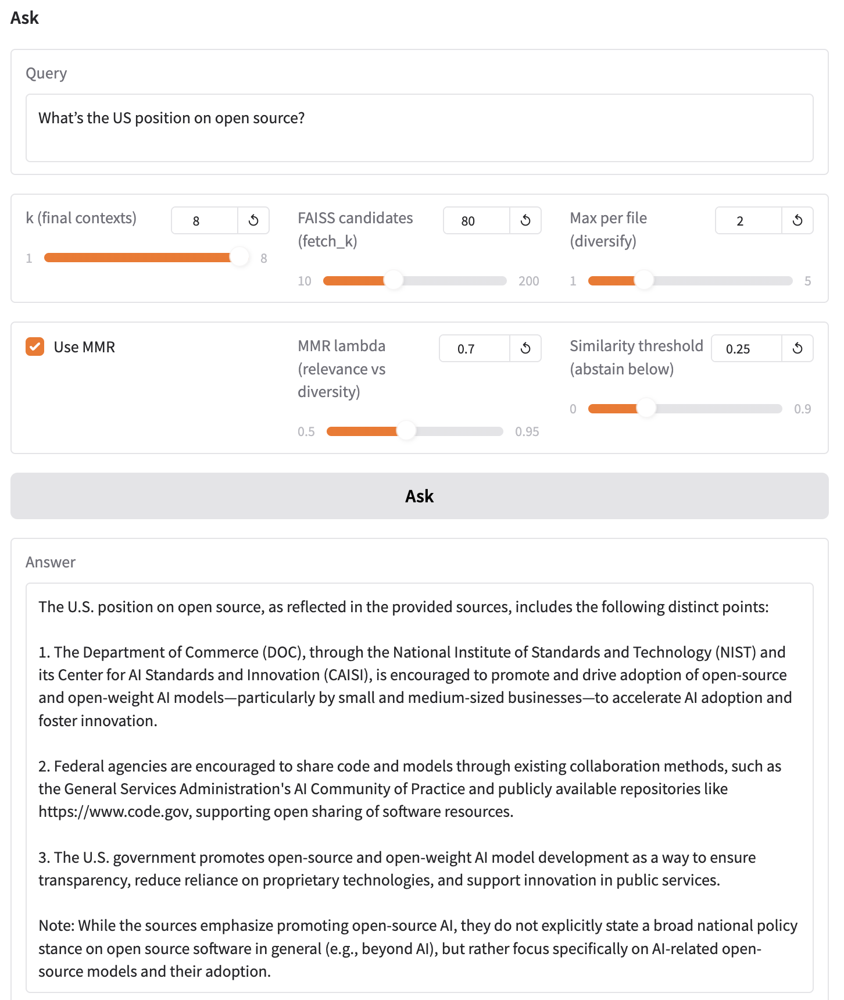

# Private Local RAG with Qwen3 Embeddings + LM Studio

This prototype shows how to build a **local Retrieval-Augmented Generation (RAG)** system using:

- **PDF ingestion** → automatically scan a folder of PDFs, chunk them, and cache them with FAISS.
- **Embeddings via LM Studio** → runs [Qwen3-Embedding](https://huggingface.co/Qwen) models locally (0.6B, 4B, 8B GGUF).
- **Diversified retrieval + MMR** → retrieve passages across multiple docs, re-rank for both relevance and diversity.
- **Local LLM for answers** → query any chat model you have loaded in LM Studio (e.g. Qwen, Gemma, Llama).
- **Gradio interface** → simple web UI for uploading PDFs, rebuilding the index, and asking questions.

Everything runs fully **offline** on your machine — no API calls, no cloud.

*Note: The RAG pipeline is not fully optimized! Feel free to build on top of it and submit pull requests.*

## Example



---

## Features

- 🔍 **Semantic search across PDFs** (FAISS + Qwen3 embeddings)
- 📄 **Automatic PDF parsing and chunking**
- 🗂 **Caching** (embeddings + index saved in `.cache/`)
- 🎛 **Configurable knobs**:  
  - chunk size, overlap  
  - number of candidates (`fetch_k`)  
  - diversification per file  
  - MMR lambda (relevance vs diversity)  
  - confidence threshold (for "I don’t know")  
- 💻 **Local inference** with [LM Studio](https://lmstudio.ai/):  
  - Embedding model (Qwen3-Embedding)  
  - Chat/completion model for answer generation
- 🌐 **Gradio UI** for uploads + interactive Q&A

---

## Setup

1. Clone this repo
2. Install deps:
   ```bash
   pip install -r requirements.txt
   ```
   (includes `faiss`, `gradio`, `openai`, `pypdf`)
3. Launch LM Studio:
   - Load a **Qwen3-Embedding** model as **Embeddings** (0.6B, 4B, or 8B GGUF).
   - Load a chat model as **Chat**.
4. Run:
   ```bash
   python gradio_app.py
   ```
   Open the local URL printed in your terminal.

---

## Usage

1. Upload PDFs or point to a folder.
2. Click **Build/Load Index** (embeds + caches once).
3. Type your question.
4. Get an answer + list of source snippets.

Example:
```
Q: Who presided at each meeting?
A: Meeting A was presided by X … Meeting B by Y …
Sources:
 - Minutes (1).pdf (p.3)
 - Minutes (2).pdf (p.4)
```

---

## Notes

- First run is slow (embedding PDFs). After that, cached index loads instantly.
- If you swap embedding models (e.g. 4B → 8B), re-run with `--rebuild` or rebuild via the Gradio button.
- You can control batch size, timeout, or force a specific embedding model with env vars:
  ```bash
  EMBED_MODEL=text-embedding-qwen3-embedding-4b EMBED_BATCH=16 EMBED_TIMEOUT=180 python gradio_app.py
  ```

---

## Roadmap

- [ ] Add reranker stage (e.g. Qwen3-Reranker) for sharper results
- [ ] Multi-modal document support (images, tables)
- [ ] Export answers + citations as JSON/Markdown

---

## License

Prototype for experimentation. No warranty.
